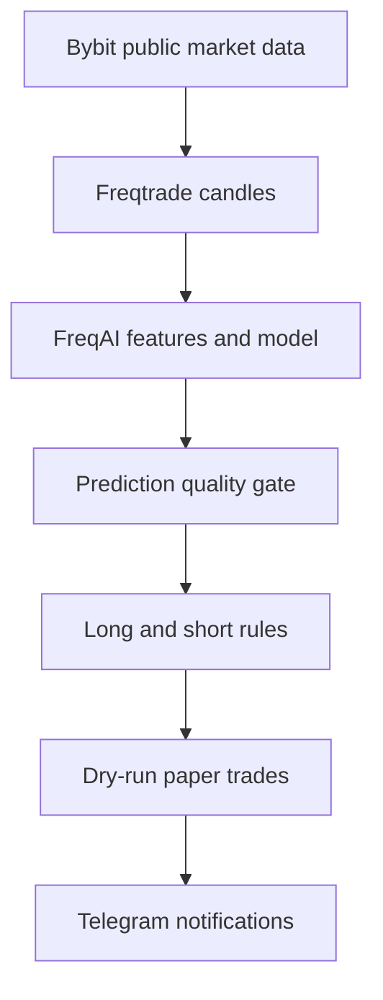

# Architecture

## Goal of milestone 1

Deliver an observable, reproducible signal pipeline before any live execution work begins. FreqAI produces forecasts, the strategy converts them into directional entry/exit signals, Freqtrade maintains paper-trade state, and Telegram reports those state changes.

## Component boundaries

| Component | Responsibility | Persistent output |
|---|---|---|
| Bybit adapter | Public USDT perpetual candles and market metadata | Cached candles |
| FreqAI | Feature expansion, training, inference, model lifecycle | `user_data/models/` |
| Strategy | Target definition, signal filters, exit rules, 1x leverage cap | Signal tags in dry-run database |
| Freqtrade engine | Scheduling, paper position state, notification events | SQLite database and logs |
| Telegram | Operator-facing status and paper entry/exit messages | Telegram chat history |

## Safety invariants

1. The checked-in configuration has `dry_run: true`.
2. Compose forces `FREQTRADE__DRY_RUN=true`.
3. Exchange key and secret are empty in the checked-in configuration.
4. The service does not forward exchange credentials from `.env`.
5. Bybit is configured for `futures` and `isolated` margin only.
6. Strategy leverage is capped at 1x.
7. CI fails if any of these invariants change.

## Signal logic

The baseline predicts the mean forward return over the configured label window. A prediction can create a paper entry only when:

- `do_predict == 1`, meaning FreqAI accepts the inference point;
- the predicted return exceeds the directional threshold;
- EMA trend agrees with the direction;
- RSI is not already at an extreme; and
- the candle has non-zero volume.

This is a research baseline, not a tuned strategy. Thresholds are constants so the first backtest results are reproducible; hyperopt and regime-specific tuning belong to later milestones.

## Branch model

- `main` stores stable checkpoints.
- `develop` integrates active work.
- Short-lived feature branches start from `develop` and return through review.

## Planned milestones

1. Signal-mode bootstrap and safety tests.
2. Walk-forward backtest harness with fee, funding, and slippage reporting.
3. Telegram signal formatting and operational health alerts.
4. Model/feature experiments with leakage checks and experiment IDs.
5. Execution readiness review; live trading remains disabled until explicitly approved.
